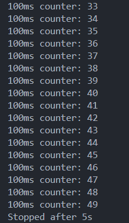

# Завдання 3

## Реалізуйте програму, яка оновлює лічильник кожні 100 мс та вимикає таймер через 5 секунд.

### Рішення

#### Наступна програма демонструє таймер на 5 секунд, що виводить в консоль повідомлення кожні 100мс.

#### Програма була реалізована з використанням `gettimeofday()`, оскільки стандартне використання `clock()` працювала не коректно, бо вона фактично рахує час для процесора і тому при тестуванні я через 80 повторень (8 секунд) закінчувалась програма, що є неправильним, бо повинна через 5 секунд. 

#### Сам розрахунок був виконаний таким чином `long elapsed_ms = (now.tv_sec - start.tv_sec) * 1000 + (now.tv_usec - start.tv_usec) / 1000`. Тобто спочатку обчислюється різниця в секундах і переводиться у мілісекунди `(now.tv_sec - start.tv_sec) * 1000`, а потім до неї додається різниця в мікросекундах, поділена на 1000 для перетворення в мілісекунди `(now.tv_usec - start.tv_usec) / 1000`. В результаті отримуємо  час в мілісекундах, від початку програми.

